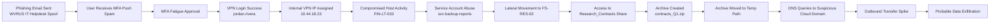

# Attack Chain Diagram

```mermaid
flowchart LR
    A[Phishing Email Sent<br/>WVRUS IT Helpdesk Spoof] --> B[User Receives MFA Push Spam]
    B --> C[MFA Fatigue Approval]
    C --> D[VPN Login Success<br/>jordan.rivera]
    D --> E[Internal VPN IP Assigned<br/>10.44.18.23]
    E --> F[Compromised Host Activity<br/>FIN-LT-033]
    F --> G[Service Account Abuse<br/>svc-backup-reports]
    G --> H[Lateral Movement to FS-RES-02]
    H --> I[Access to Research_Contracts Share]
    I --> J[Archive Created<br/>contracts_Q1.zip]
    J --> K[Archive Moved to Temp Path]
    K --> L[DNS Queries to Suspicious Cloud Domain]
    L --> M[Outbound Transfer Spike]
    M --> N[Probable Data Exfiltration]
```

