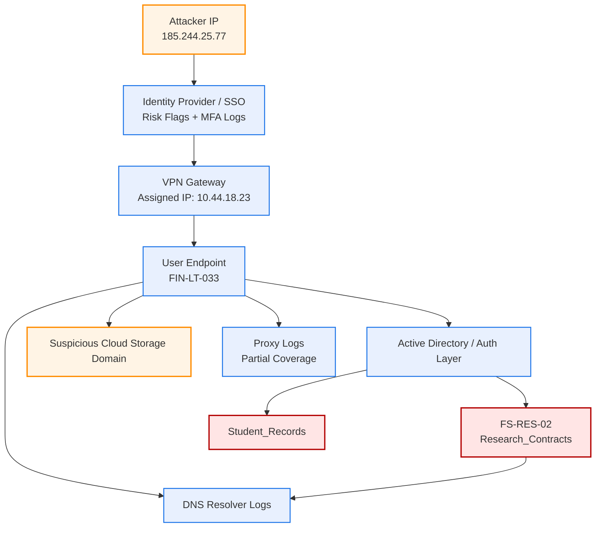

# Network Architecture Diagram

```mermaid
flowchart TB
    ATTACKER[Attacker IP<br/>185.244.25.77]
    IDP[Identity Provider / SSO<br/>Risk Flags + MFA Logs]
    VPN[VPN Gateway<br/>Assigned IP: 10.44.18.23]
    USER[User Endpoint<br/>FIN-LT-033]
    AD[Active Directory / Auth Layer]
    FILE[FS-RES-02<br/>Research_Contracts]
    STUDENT[Student_Records]
    CLOUD[Suspicious Cloud Storage Domain]
    DNS[DNS Resolver Logs]
    PROXY[Proxy Logs<br/>Partial Coverage]

    ATTACKER --> IDP
    IDP --> VPN
    VPN --> USER
    USER --> AD
    AD --> FILE
    AD --> STUDENT
    USER --> DNS
    FILE --> DNS
    USER --> PROXY
    USER --> CLOUD

    classDef crown fill:#ffe5e5,stroke:#b30000,stroke-width:2px;
    classDef infra fill:#e8f0fe,stroke:#1a73e8,stroke-width:1.5px;
    classDef attacker fill:#fff4e5,stroke:#ff8c00,stroke-width:2px;

    class FILE,STUDENT crown;
    class IDP,VPN,USER,AD,DNS,PROXY infra;
    class ATTACKER,CLOUD attacker;
```

